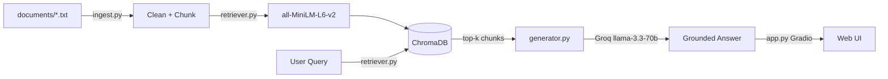

# Project 1 Planning: The Unofficial Guide

> Write this document before you write any pipeline code.
> Your spec and architecture diagram are what you'll use to direct AI tools (Claude, Copilot, etc.) to generate your implementation — the more specific they are, the more useful the generated code will be.
> Update the Retrieval Approach and Chunking Strategy sections if you change your approach during implementation.
> Update this file before starting any stretch features.

---

## Domain

Campus dining knowledge — student reviews, forum posts, and unofficial guides about dining halls, meal plans, wait times, dietary options, and late-night food. This knowledge is valuable because official university dining pages show menus and hours but not real wait times, which hall to avoid on Thursdays, or whether the dining app is trustworthy. Students share this through Reddit threads, Discord pins, and orientation wikis, but it is scattered and hard to search.

---

## Documents

| # | Source | Description | URL or location |
|---|--------|-------------|-----------------|
| 1 | r/college dining thread | North Hall student reviews (wait times, vegan options) | `documents/north_hall_reviews.txt` |
| 2 | Yelp + Reddit compilation | South Hall reviews (international night, mold report) | `documents/south_hall_reviews.txt` |
| 3 | Discord #food channel | West Village food court tips for CS majors | `documents/west_village_eats.txt` |
| 4 | Orientation wiki | Unofficial meal plan guide (swipes, dining dollars) | `documents/meal_plan_guide.txt` |
| 5 | Housing forum FAQ | Housing lottery vs. dining access, celiac options | `documents/housing_dining_faq.txt` |
| 6 | Student survival thread | Late-night food options after midnight | `documents/late_night_food.txt` |
| 7 | CS department Discord | Food tips for back-to-back classes, hackathons | `documents/cs_major_food_tips.txt` |
| 8 | App Store reviews + Reddit | Dining app complaints (wrong menus, wait times) | `documents/dining_app_complaints.txt` |
| 9 | Sustainability club audit | Composting, reusable containers, local sourcing | `documents/sustainability_dining.txt` |
| 10 | Anonymous student blog | Finals week dining hours and survival tips | `documents/finals_week_survival.txt` |
| 11 | Orientation mentor handout | Common freshman dining mistakes | `documents/freshman_dining_mistakes.txt` |

---

## Chunking Strategy

**Chunk size:** 400 characters

**Overlap:** 80 characters

**Reasoning:** My documents are mostly short reviews and FAQ entries (1–3 paragraphs each), not long guides. A 400-character chunk fits 2–3 sentences of review text — enough context for semantic search without merging unrelated topics. I split on paragraph boundaries first, then fall back to fixed-size windows with overlap for longer paragraphs. The 80-character overlap ensures facts that span sentence boundaries (e.g., "North Hall has the shortest lunch wait… if you go before 11:45") stay retrievable even if the split lands mid-thought. Chunks smaller than 200 characters would lose semantic signal; chunks above 600 would merge unrelated reviews from the same file.

---

## Retrieval Approach

**Embedding model:** `all-MiniLM-L6-v2` via sentence-transformers (runs locally, no API key)

**Top-k:** 5

**Production tradeoff reflection:** For production I would weigh: (1) **accuracy on informal student language** — a larger model like `e5-large-v2` may better capture slang and nicknames; (2) **context length** — longer documents would need models with larger input windows; (3) **multilingual support** — if the campus has international students posting in other languages, `multilingual-e5` would help; (4) **latency vs. cost** — API-hosted embeddings (OpenAI, Cohere) scale better but add per-query cost; local models are free but slower on CPU. For this corpus of English review text, MiniLM is a reasonable baseline.

---

## Evaluation Plan

| # | Question | Expected answer |
|---|----------|-----------------|
| 1 | Which dining hall has the shortest lunch wait? | North Hall before 11:45 AM; after noon lines reach 20–25 minutes. South Hall averages 10–15 minutes at lunch except Thursday. |
| 2 | Does the housing lottery affect which dining hall I can use? | No. Meal plan access is the same regardless of dorm assignment. |
| 3 | What gluten-free options do students recommend? | North Hall has a dedicated gluten-free station with separate prep area. South Hall has GF labels but shared fryers. |
| 4 | What are the late-night food options on campus? | South Hall late night Sun–Wed 9pm–midnight; 24-hour diner on College Ave (weekends); food trucks Friday on Library Lawn. |
| 5 | What do students say about the dining app wait time estimates? | Unreliable — North Hall showed "5 minutes" during a 30-minute line. |

---

## Anticipated Challenges

1. **Contradictory student opinions:** North Hall reviews say "shortest wait before 11:45" while South Hall reviews say "lunch is faster than North." Retrieval may return both, and the LLM could pick the wrong one or blend them incorrectly.

2. **Chunk boundary splits:** FAQ documents pack multiple Q&A pairs into one file. A chunk split mid-answer could return a fragment like "outh Hall runs a reduced schedule" without the question context, hurting both retrieval scores and generation quality.

---

## Architecture

| Stage | Tool / Library |
|-------|----------------|
| Document Ingestion | `ingest.py` — pathlib, regex cleaning |
| Chunking | `ingest.py` — paragraph-aware split, 400 chars / 80 overlap |
| Embedding + Vector Store | `retriever.py` — sentence-transformers, ChromaDB |
| Retrieval | `retriever.py` — cosine similarity, top-k=5 |
| Generation | `generator.py` — Groq API (llama-3.3-70b-versatile) |
| Query Interface | `app.py` — Gradio web UI |

---

## AI Tool Plan

**Milestone 3 — Ingestion and chunking:**

- **Tool:** Cursor (Claude)
- **Input:** Documents section, Chunking Strategy section, and architecture diagram from this file; assignment Milestone 3 requirements.
- **Expected output:** `ingest.py` with `load_documents()`, `clean_text()`, `chunk_text()`, and `build_chunks()`.
- **Verification:** Run `python ingest.py`, print 5 chunks, confirm each is readable and 34 total chunks across 11 documents.

**Milestone 4 — Embedding and retrieval:**

- **Tool:** Cursor (Claude)
- **Input:** Retrieval Approach section, architecture diagram, and chunk output from Milestone 3.
- **Expected output:** `retriever.py` with `embed_and_store()` and `retrieve()` using ChromaDB + all-MiniLM-L6-v2.
- **Verification:** Query 3 evaluation questions, check top result distance < 0.7 and content is on-topic.

**Milestone 5 — Generation and interface:**

- **Tool:** Cursor (Claude)
- **Input:** Grounding requirements from assignment, `generator.py` system prompt design, Gradio skeleton from assignment.
- **Expected output:** `generator.py`, `query.py`, `app.py` with source attribution in UI.
- **Verification:** Ask 2 in-scope and 1 out-of-scope question; confirm citations appear and out-of-scope gets refusal.
